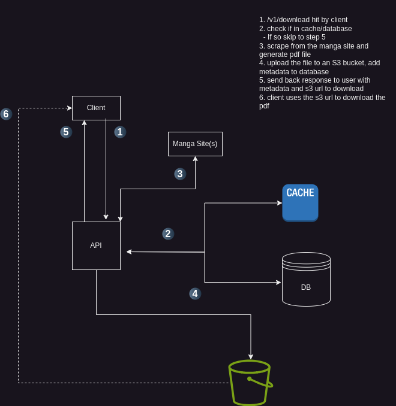

# Web App

Two versions here, one without user/relational data.



## Simple

### Endpoints

#### Search Mangas

Request:

```
GET /v1/search?query=dragon&sources=mangaka,mangafast

query:   <search-term>      STR
sources: <manga-sources>    LIST[STR]
```

Response:

```
[
  {
    'title': 'dragonball',
    'latest_volume': 98,
    'source': 'mangaka',
  },
  ...
]
```

#### Download Mangas

Request:

```
GET /v1/download?manga=dragonball&volumes=1,2,78&source=mangafast

manga:   <manga-name>                    STR
volumes: <volumes-to-download>           LIST[INTS]
source:  <name-source-to-download-from>  STR
```

- Response:

Using pre-signed S3 URLS allows us to keep the S3 bucket private and time limit the URLs access

```
[
  {
    'title': 'dragonball',
    'volume': 98,
    's3_url': <s3-pre-signed-url> OR null,
  },
  ...
]
```

### Database

As we have no relational data we can just store the information in a NoSQL database.

#### MongoDB

One database, one collection (`mangas`) with all documents:

```
  {
    'title': 'dragonball',
    'volume': 98,
    's3_url': <s3-pre-signed-url> OR null,
  }
```

## Less Simple

Storing user data and relational data is required if we want to show users their specific manga

### (More) Endpoints

#### Sign Up

- Request:

```
POST /v1/register

{
  'username': 'user',
  'password': 'pass',
}
```

Save password hashes to DB

- Response:

```
{
  "success": true,
  "message": "successfully registered"
}
```

#### Token

Token can be given in `Authorization` header

```
POST /v1/login

{
  'username': 'user',
  'password': 'pass',
}
```

- Response:

```
{
  'token': <token>
}
```

### Database

#### Postgres

If we want to associate users with their mangas

| id  | username   | password        |
| --- | ---------- | --------------- |
| 1   | david.ross | \<hashed-pass\> |
| 2   | james.guy  | \<hashed-pass\> |

The manga volume is an FK to manga table

| id  | volume | manga | download_url |
| --- | ------ | ----- | ------------ |
| 1   | 98     | 2     | \<s3-url\>   |
| 2   | 89     | 1     | \<s3-url\>   |

| id  | manga | name       |
| --- | ----- | ---------- |
| 1   | 1     | dragonball |
| 2   | 2     | bleach     |

Mapping table FK to user table and FK to volume table:

| user_id | volume_id |
| ------- | --------- |
| 1       | 1         |
| 1       | 2         |
| 2       | 2         |
